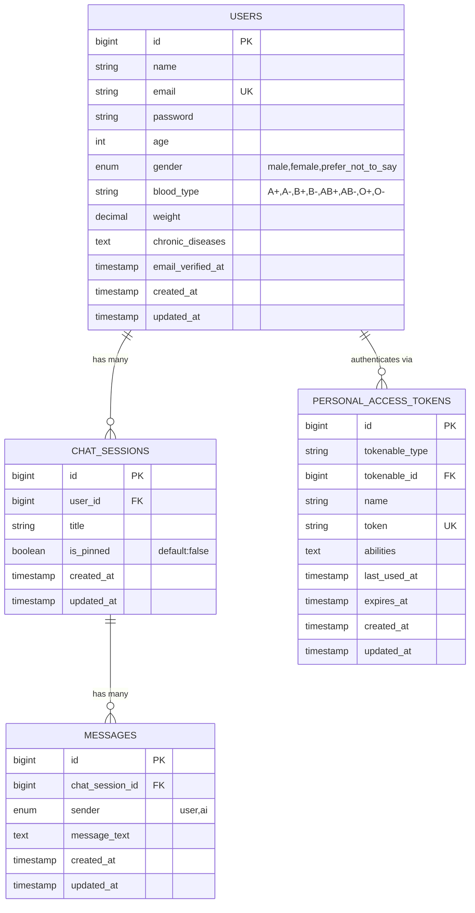
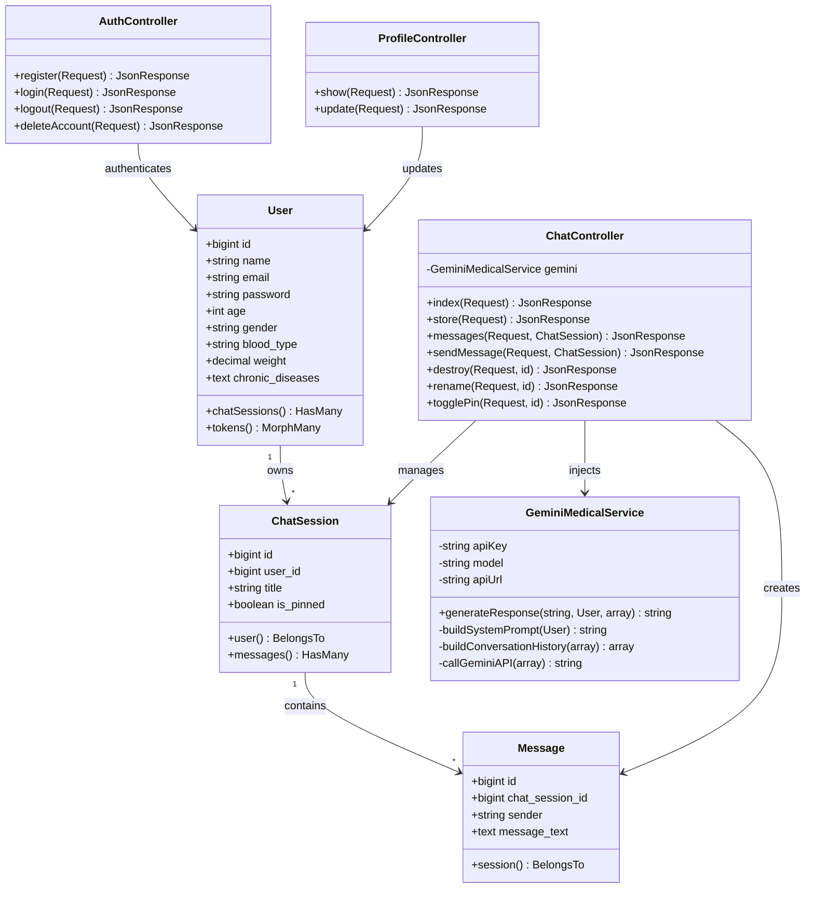
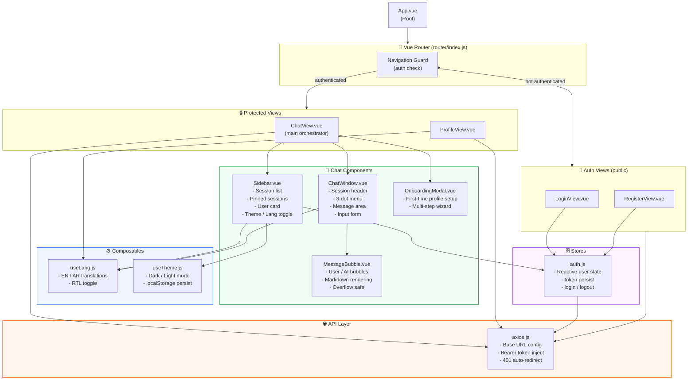
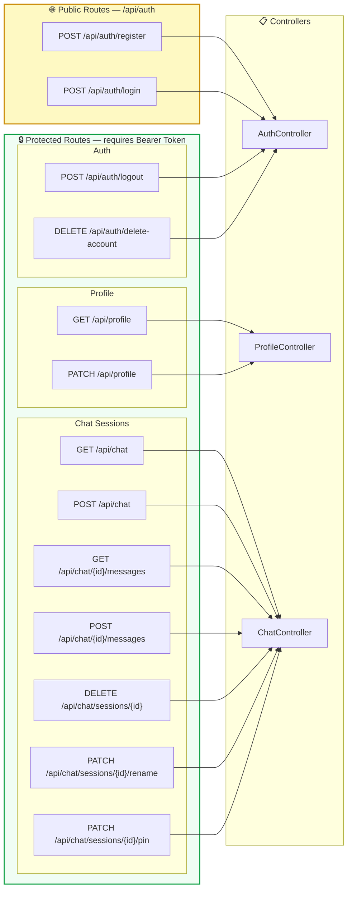
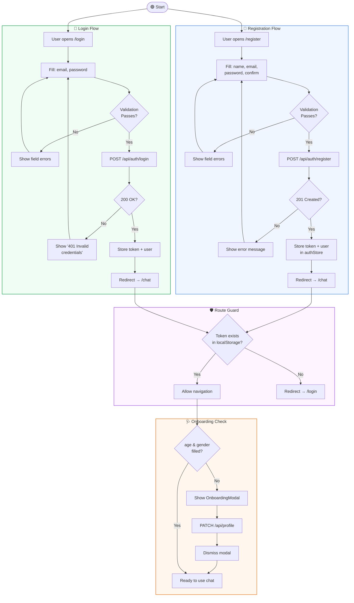
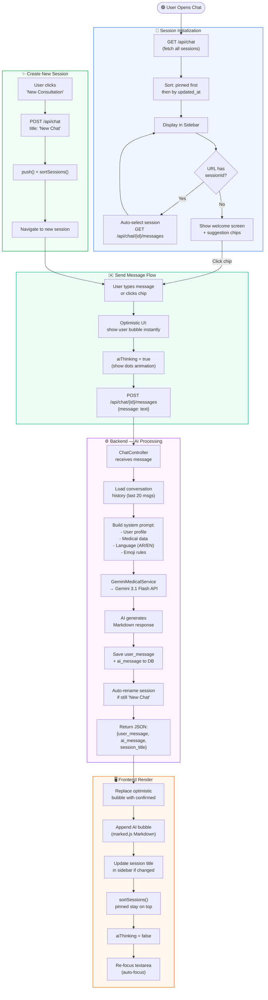
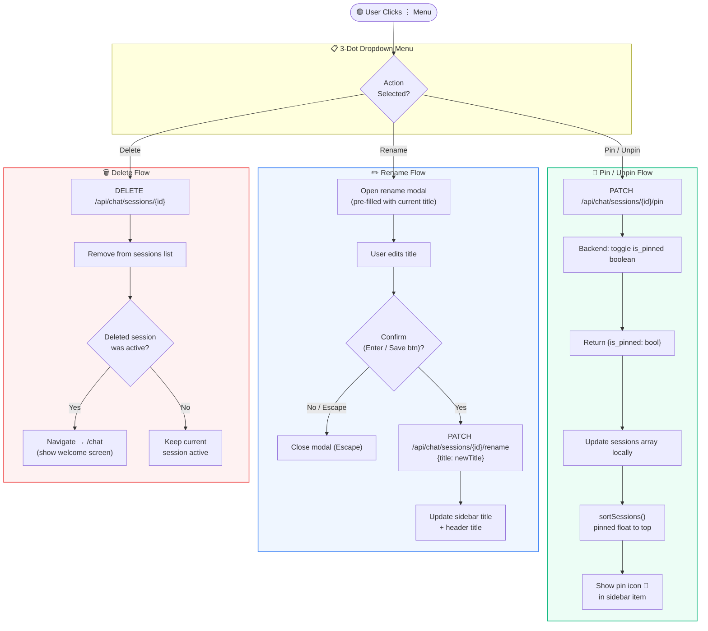
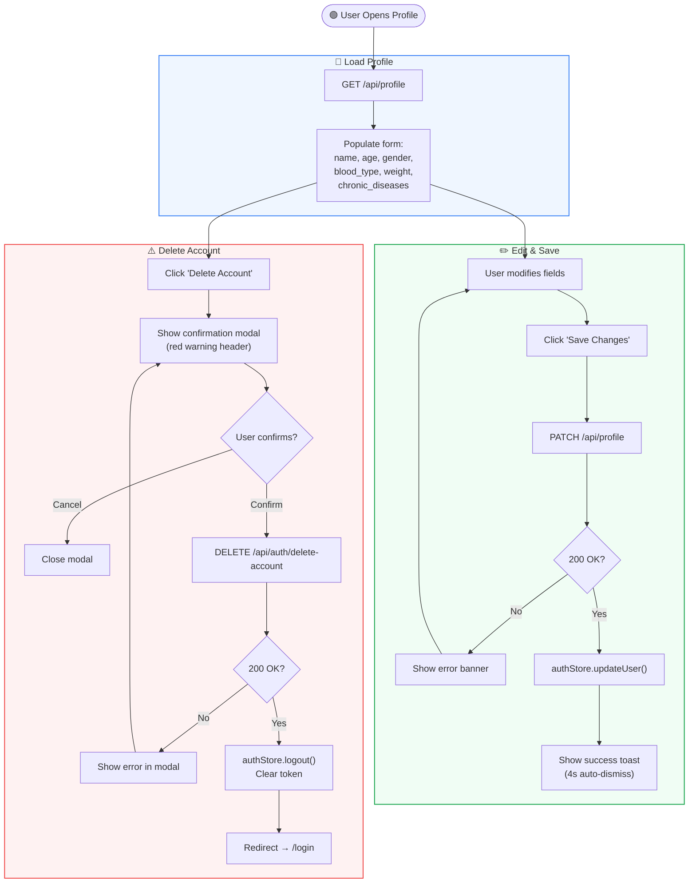
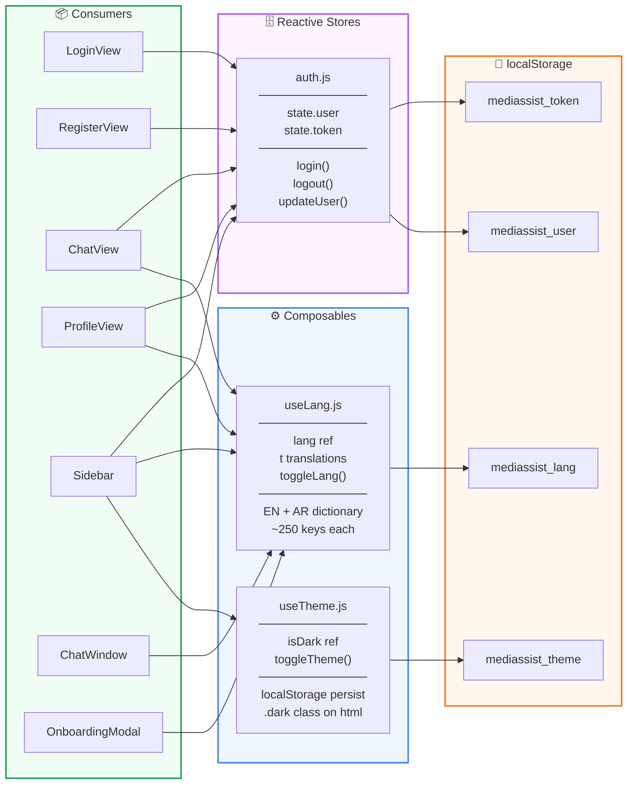

# MediAssist AI — Complete System Architecture & BPMN Reference

> **Version:** 2.0 | **Stack:** Laravel 11 (API) + Vue 3 (SPA) + Google Gemini 3.1 Flash  
> **Render at:** [mermaid.live](https://mermaid.live) — paste any `mermaid` block to visualize it instantly.

---

## 📋 Table of Contents

| # | Diagram | Type |
|---|---------|------|
| 1 | [Full System — Single Connected Diagram](#1-full-system-connected-diagram) | `graph TB` |
| 2 | [Database ERD](#2-database-erd) | `erDiagram` |
| 3 | [Backend Class & Dependency Map](#3-backend-class-map) | `classDiagram` |
| 4 | [Frontend Component Tree](#4-frontend-component-tree) | `graph TD` |
| 5 | [API Routes Map](#5-api-routes-map) | `graph LR` |
| 6 | [BPMN — Authentication Flow](#6-bpmn-authentication-flow) | `flowchart TD` |
| 7 | [BPMN — Chat & AI Consultation Flow](#7-bpmn-chat--ai-flow) | `flowchart TD` |
| 8 | [BPMN — Session Management Flow](#8-bpmn-session-management-flow) | `flowchart TD` |
| 9 | [BPMN — Profile Management Flow](#9-bpmn-profile-management-flow) | `flowchart TD` |
| 10 | [Sequence Diagram — Frontend ↔ Backend ↔ Gemini AI](#10-sequence-diagram) | `sequenceDiagram` |
| 11 | [State Management — Stores & Composables](#11-state-management) | `graph LR` |
| 12 | [File Structure Reference](#12-file-structure-reference) | — |

---

## 1. Full System — Single Connected Diagram

> **📌 This is the main diagram — paste the code block below directly into [mermaid.live](https://mermaid.live)**

```mermaid
graph TB

    %% ═══════════════════════════════════════════════════════════════════
    %%  MediAssist AI — Full Connected System Architecture
    %%  Stack: Laravel 11 + Vue 3 + Gemini 3.1 Flash
    %%  Render at: https://mermaid.live
    %% ═══════════════════════════════════════════════════════════════════

    USER(["👤 User / Browser"])

    %% ─── FRONTEND LAYER ─────────────────────────────────────────────────
    subgraph FE["🖥️  FRONTEND — Vue 3 SPA (Vite + TailwindCSS v4)"]
        direction TB

        subgraph ENTRY["Entry & Routing"]
            APP_JS["app.js\nVue Bootstrap"]
            APP_VUE["App.vue\nRoot Component"]
            ROUTER["router/index.js\nVue Router 4\n+ beforeEach Auth Guard"]
        end

        subgraph AUTH_VIEWS["🔐 Auth Views (Public)"]
            LOGIN["LoginView.vue\nEmail + Password\nSplit-panel design"]
            REGISTER["RegisterView.vue\nName + Email + Password"]
        end

        subgraph MAIN_VIEWS["🔒 Protected Views"]
            CHAT_VIEW["ChatView.vue\nMain Orchestrator\nsessions, sort, send, pin"]
            PROFILE_VIEW["ProfileView.vue\nMedical Profile\n+ Delete Account"]
        end

        subgraph COMPONENTS["💬 UI Components"]
            SIDEBAR["Sidebar.vue\n• Session list (sorted)\n• Pinned sessions 📌\n• User card → Profile\n• New Consultation btn\n• Theme / Lang toggles\n• Logout btn"]
            CHATWIN["ChatWindow.vue\n• Session header\n• 3-dot menu ⋮\n  (pin / rename / delete)\n• Message area\n• Textarea + Send btn"]
            MSGBUBBLE["MessageBubble.vue\n• User bubble (right)\n• AI bubble (left)\n• Markdown via marked.js\n• word-break overflow safe"]
            ONBOARD["OnboardingModal.vue\n• First-time wizard\n• Step 1: age + gender\n• Step 2: medical data\n• PATCH /api/profile"]
        end

        subgraph COMPOSABLES["⚙️ Composables"]
            USELANG["useLang.js\n• EN / AR dictionary\n• 250+ translation keys\n• toggleLang()\n• RTL detection"]
            USETHEME["useTheme.js\n• isDark ref\n• toggleTheme()\n• .dark on html\n• localStorage persist"]
        end

        subgraph STATE["🗄️ State & API"]
            AUTH_STORE["stores/auth.js\n• state.user\n• state.token\n• login()\n• logout()\n• updateUser()"]
            AXIOS_JS["api/axios.js\n• Base URL: /api\n• Bearer token inject\n• 401 → redirect /login"]
        end

        subgraph PERSIST["💾 localStorage"]
            LS1["mediassist_token"]
            LS2["mediassist_user"]
            LS3["mediassist_lang"]
            LS4["mediassist_theme"]
        end
    end

    %% ─── BACKEND LAYER ───────────────────────────────────────────────────
    subgraph BE["⚙️  BACKEND — Laravel 11 (PHP 8.2)"]
        direction TB

        subgraph MIDDLEWARE["🛡️ Security Layer"]
            SANCTUM["Laravel Sanctum\nBearer Token Validation\nPersonal Access Tokens"]
            AUTH_MW["auth:sanctum\nMiddleware"]
        end

        subgraph ROUTES["🗺️ routes/api.php"]
            PUB_ROUTES["Public Routes\nPOST /auth/register\nPOST /auth/login"]
            PROT_ROUTES["Protected Routes\nPOST /auth/logout\nDELETE /auth/delete-account\nGET|PATCH /profile\nGET|POST /chat\nGET|POST /chat/{id}/messages\nDELETE /sessions/{id}\nPATCH /sessions/{id}/rename\nPATCH /sessions/{id}/pin"]
        end

        subgraph CONTROLLERS["🎮 Controllers"]
            AUTH_C["AuthController\n• register()\n• login()\n• logout()\n• deleteAccount()"]
            CHAT_C["ChatController\n• index() — list + sort sessions\n• store() — new session\n• messages() — history\n• sendMessage() — AI call\n• destroy()\n• rename()\n• togglePin()"]
            PROF_C["ProfileController\n• show()\n• update()"]
        end

        subgraph MODELS["📦 Eloquent Models"]
            USER_M["User.php\nfillable: name, email, age\ngender, blood_type, weight\nchronic_diseases\nhasMany → ChatSession\nhasMany → Token"]
            SESSION_M["ChatSession.php\nfillable: title, is_pinned\ncast: is_pinned → boolean\nbelongsTo → User\nhasMany → Message"]
            MSG_M["Message.php\nfillable: sender, message_text\nbelongsTo → ChatSession"]
        end

        subgraph SERVICE["🤖 AI Service"]
            GEMINI_SVC["GeminiMedicalService.php\n• buildSystemPrompt(user)\n  — name, age, gender\n  — blood_type, weight\n  — chronic_diseases\n  — language + emoji rules\n  — AR/EN response format\n• buildConversationHistory()\n• callGeminiAPI()\n• generateResponse()"]
        end
    end

    %% ─── DATABASE LAYER ─────────────────────────────────────────────────
    subgraph DB["🗄️  DATABASE — SQLite"]
        direction LR

        T_USERS[("users\n─────────\nid PK\nname, email UK\npassword\nage, gender\nblood_type, weight\nchronic_diseases\ncreated_at, updated_at")]
        T_SESSIONS[("chat_sessions\n─────────\nid PK\nuser_id FK → users\ntitle\nis_pinned BOOL\ncreated_at, updated_at")]
        T_MESSAGES[("messages\n─────────\nid PK\nchat_session_id FK\nsender: user|ai\nmessage_text TEXT\ncreated_at, updated_at")]
        T_TOKENS[("personal_access_tokens\n─────────\nid PK\ntokenable_id FK → users\ntoken UK\nabilities\nlast_used_at")]
    end

    %% ─── EXTERNAL SERVICES ──────────────────────────────────────────────
    subgraph EXT["☁️  EXTERNAL SERVICES"]
        GEMINI_API["Google Gemini 3.1 Flash\nREST API\nPOST /v1beta/models/\ngemini-3.1-flash:generateContent\nheader: x-goog-api-key"]
        VITE["Vite Build Tool\npublic/build/\nmanifest.json\nassets (JS + CSS)"]
    end

    %% ═══════════════════════════════════════════════════════════════════
    %%  CONNECTIONS — How everything talks to each other
    %% ═══════════════════════════════════════════════════════════════════

    %% ── User Entry ──
    USER -->|"Opens browser"| APP_JS
    APP_JS --> APP_VUE --> ROUTER
    VITE -->|"Compiled assets\napp.js + app.css"| APP_JS

    %% ── Router navigation ──
    ROUTER -->|"/ or /login → public"| LOGIN
    ROUTER -->|"/register"| REGISTER
    ROUTER -->|"/chat\n(auth guard ✓)"| CHAT_VIEW
    ROUTER -->|"/profile\n(auth guard ✓)"| PROFILE_VIEW

    %% ── Auth store & persistence ──
    LOGIN --> AUTH_STORE
    REGISTER --> AUTH_STORE
    AUTH_STORE -->|"persist token"| LS1
    AUTH_STORE -->|"persist user"| LS2
    USELANG -->|"persist lang"| LS3
    USETHEME -->|"persist theme"| LS4

    %% ── Axios API calls from Auth views ──
    LOGIN -->|"POST /api/auth/login"| AXIOS_JS
    REGISTER -->|"POST /api/auth/register"| AXIOS_JS

    %% ── ChatView orchestrates all components ──
    CHAT_VIEW --> SIDEBAR
    CHAT_VIEW --> CHATWIN
    CHAT_VIEW --> ONBOARD
    CHATWIN --> MSGBUBBLE

    %% ── ChatView & ProfileView use Axios ──
    CHAT_VIEW -->|"GET /chat\nPOST /chat\nPATCH pin + rename\nDELETE session\nPOST /messages"| AXIOS_JS
    PROFILE_VIEW -->|"GET|PATCH /profile\nDELETE /auth/delete-account"| AXIOS_JS

    %% ── Composables wired to all consumers ──
    SIDEBAR --> USELANG
    SIDEBAR --> USETHEME
    SIDEBAR --> AUTH_STORE
    CHATWIN --> USELANG
    PROFILE_VIEW --> USELANG
    ONBOARD --> USELANG
    LOGIN --> USELANG
    REGISTER --> USELANG

    %% ── Frontend → Backend ──
    AXIOS_JS -->|"HTTPS + Bearer Token\nContent-Type: application/json"| SANCTUM

    %% ── Sanctum validates token → middleware → routes ──
    SANCTUM -->|"validate token"| T_TOKENS
    SANCTUM --> AUTH_MW
    PUB_ROUTES -->|"no token needed"| AUTH_C
    AUTH_MW --> PROT_ROUTES
    PROT_ROUTES --> AUTH_C
    PROT_ROUTES --> CHAT_C
    PROT_ROUTES --> PROF_C

    %% ── Controllers → Models ──
    AUTH_C --> USER_M
    PROF_C --> USER_M
    CHAT_C --> SESSION_M
    CHAT_C --> MSG_M

    %% ── ChatController → AI Service ──
    CHAT_C -->|"sendMessage():\ntext + user profile\n+ conversation history"| GEMINI_SVC

    %% ── Models → Database ──
    USER_M -->|"Eloquent ORM"| T_USERS
    SESSION_M -->|"Eloquent ORM"| T_SESSIONS
    MSG_M -->|"Eloquent ORM"| T_MESSAGES
    AUTH_C -->|"createToken()"| T_TOKENS

    %% ── DB Relations ──
    T_USERS -.->|"1 : N"| T_SESSIONS
    T_SESSIONS -.->|"1 : N"| T_MESSAGES

    %% ── AI Service → External Gemini API ──
    GEMINI_SVC -->|"buildSystemPrompt\n+ conversation history\nREST POST request"| GEMINI_API
    GEMINI_API -->|"AI Markdown response\ncandidates[0].content\n.parts[0].text"| GEMINI_SVC
    GEMINI_SVC -->|"aiResponse string"| CHAT_C

    %% ─── STYLES ─────────────────────────────────────────────────────────
    style FE fill:#eff6ff,stroke:#3b82f6,stroke-width:2.5px,color:#1e3a5f
    style BE fill:#f0fdf4,stroke:#16a34a,stroke-width:2.5px,color:#14532d
    style DB fill:#fdf4ff,stroke:#a855f7,stroke-width:2.5px,color:#3b0764
    style EXT fill:#fff7ed,stroke:#f97316,stroke-width:2.5px,color:#7c2d12

    style ENTRY fill:#dbeafe,stroke:#3b82f6,stroke-width:1.5px
    style AUTH_VIEWS fill:#dcfce7,stroke:#16a34a,stroke-width:1.5px
    style MAIN_VIEWS fill:#d1fae5,stroke:#10b981,stroke-width:1.5px
    style COMPONENTS fill:#e0f2fe,stroke:#0284c7,stroke-width:1.5px
    style COMPOSABLES fill:#ede9fe,stroke:#7c3aed,stroke-width:1.5px
    style STATE fill:#fce7f3,stroke:#db2777,stroke-width:1.5px
    style PERSIST fill:#fef9c3,stroke:#ca8a04,stroke-width:1.5px

    style MIDDLEWARE fill:#fee2e2,stroke:#dc2626,stroke-width:1.5px
    style ROUTES fill:#fef3c7,stroke:#d97706,stroke-width:1.5px
    style CONTROLLERS fill:#d1fae5,stroke:#059669,stroke-width:1.5px
    style MODELS fill:#e0f2fe,stroke:#0369a1,stroke-width:1.5px
    style SERVICE fill:#fdf4ff,stroke:#7c3aed,stroke-width:1.5px
```



---

## 2. Database ERD



---

## 3. Backend Class Map



---

## 4. Frontend Component Tree



---

## 5. API Routes Map



---

## 6. BPMN — Authentication Flow



---

## 7. BPMN — Chat & AI Flow



---

## 8. BPMN — Session Management Flow



---

## 9. BPMN — Profile Management Flow



---

## 10. Sequence Diagram


---

## 11. State Management



---

## 12. File Structure Reference

```
ai-medical-assistant/
│
├── 📄 ARCHITECTURE.md           ← This file (all diagrams)
├── 📄 SYSTEM_DIAGRAM.md         ← Legacy single diagram (superseded)
│
├── 📁 app/
│   ├── 📁 Http/Controllers/Api/
│   │   ├── AuthController.php       # register, login, logout, deleteAccount
│   │   ├── ChatController.php       # CRUD sessions + sendMessage + rename + pin
│   │   └── ProfileController.php    # show, update
│   │
│   ├── 📁 Models/
│   │   ├── User.php                 # fillable, casts, hasMany(ChatSession)
│   │   ├── ChatSession.php          # fillable=[title,is_pinned], boolean cast
│   │   └── Message.php              # fillable=[sender,message_text]
│   │
│   └── 📁 Services/
│       └── GeminiMedicalService.php # AI prompt builder + Gemini 3.1 API caller
│
├── 📁 database/migrations/
│   ├── create_users_table
│   ├── add_medical_fields_to_users   # age, gender, chronic_diseases
│   ├── add_physical_data_to_users    # blood_type, weight
│   ├── create_chat_sessions_table    # title, user_id
│   ├── add_is_pinned_to_chat_sessions # is_pinned boolean
│   ├── create_messages_table         # sender, message_text, chat_session_id
│   └── create_personal_access_tokens # Sanctum tokens
│
├── 📁 routes/
│   └── api.php                      # 13 REST API endpoints
│
└── 📁 resources/js/
    ├── App.vue                      # Root component
    ├── app.js                       # Vue app bootstrap
    │
    ├── 📁 api/
    │   └── axios.js                 # Axios instance + token injection + 401 guard
    │
    ├── 📁 router/
    │   └── index.js                 # Routes + beforeEach auth guard
    │
    ├── 📁 stores/
    │   └── auth.js                  # Reactive auth state (user + token)
    │
    ├── 📁 composables/
    │   ├── useLang.js               # i18n EN/AR, 250+ keys, RTL toggle
    │   └── useTheme.js              # Dark/Light mode, localStorage
    │
    ├── 📁 views/
    │   ├── LoginView.vue            # Login (split-panel dark design)
    │   ├── RegisterView.vue         # Register page
    │   ├── ChatView.vue             # Main orchestrator (sessions + messages)
    │   └── ProfileView.vue          # Medical profile + delete account
    │
    └── 📁 components/
        ├── Sidebar.vue              # Session list, pin 📌, nav, theme toggle
        ├── ChatWindow.vue           # Header + 3-dot menu + messages + input
        ├── MessageBubble.vue        # User/AI chat bubbles, marked.js Markdown
        └── OnboardingModal.vue      # First-time profile setup wizard
```

---

> **🛠️ Tech Stack Summary:**
>
> | Layer | Technology |
> |-------|-----------|
> | Backend | PHP 8.2, Laravel 11, Laravel Sanctum |
> | Database | SQLite (dev) — MySQL/PostgreSQL (prod) |
> | Frontend | Vue 3 Composition API, Vite, TailwindCSS v4 |
> | Routing | Vue Router 4 |
> | Markdown | marked.js |
> | AI | Google Gemini 3.1 Flash (REST API) |
> | Auth | Bearer Tokens (Sanctum) in localStorage |
> | i18n | Custom `useLang.js` (Arabic + English, 250+ keys) |
> | Build | Vite → `public/build/` |
>
> **📌 To render any diagram:** Copy the code inside any ` ```mermaid ` block and paste it at [mermaid.live](https://mermaid.live)
