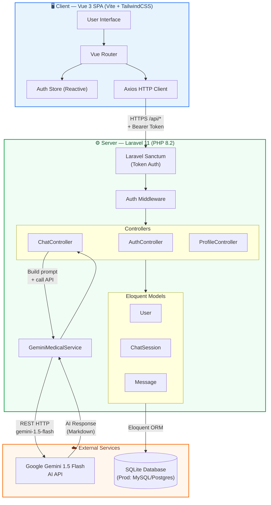
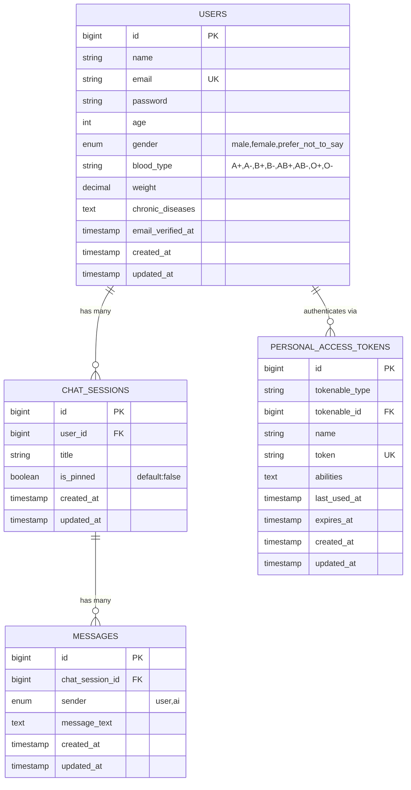
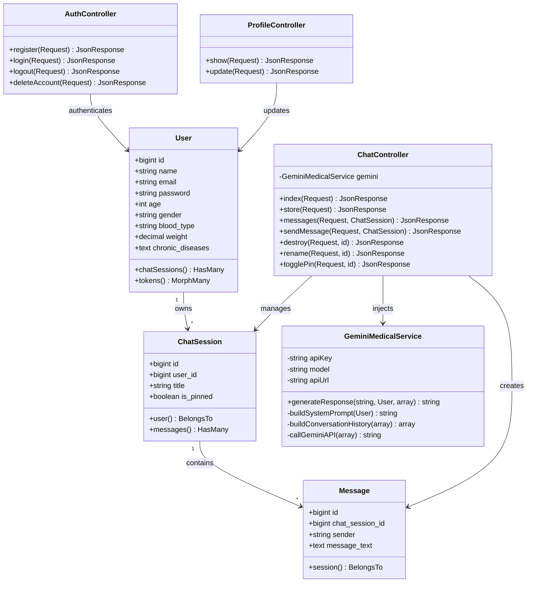
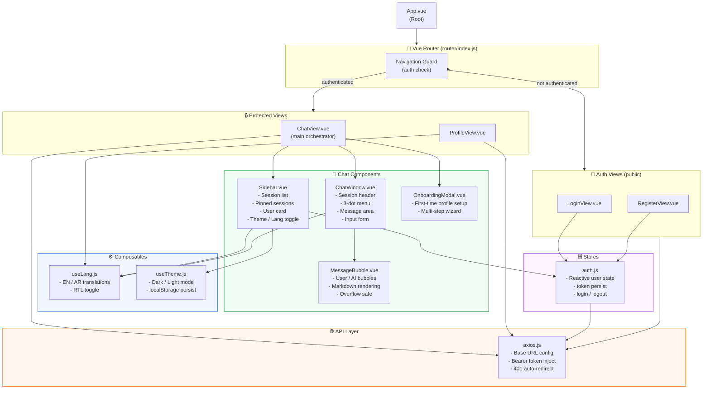
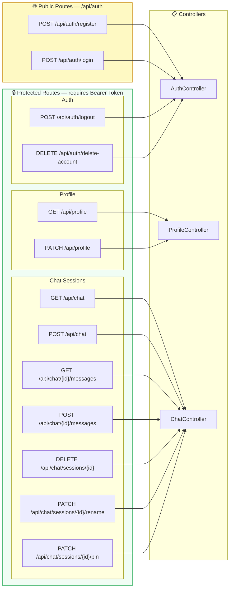
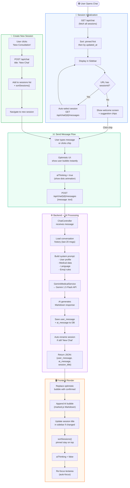
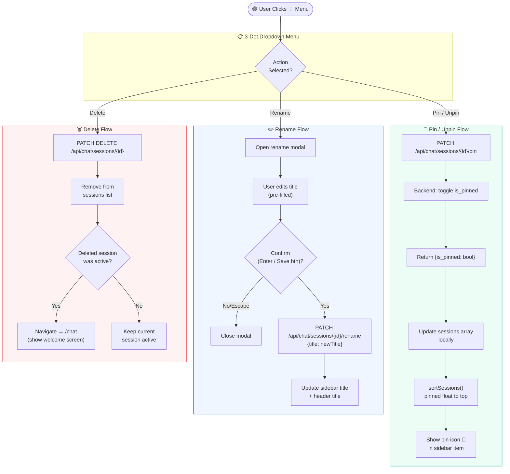
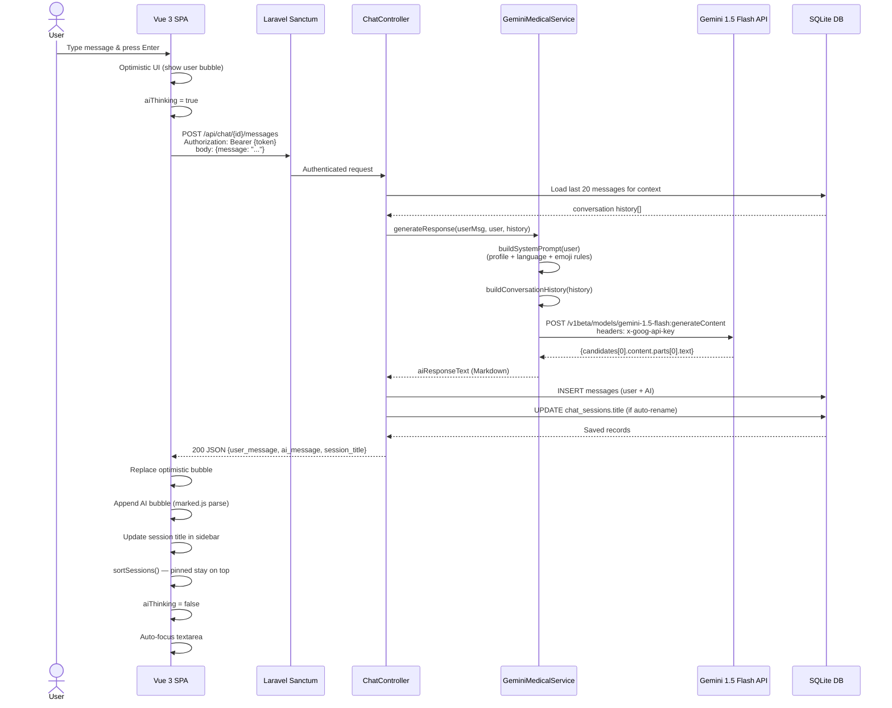

# MediAssist AI — System Architecture & BPMN Diagrams

> **Version:** 1.0 | **Stack:** Laravel 11 (Backend API) + Vue 3 (SPA Frontend) + Google Gemini AI  
> **Render at:** [mermaid.live](https://mermaid.live) — paste any diagram block to visualize it.

---

## Table of Contents

1. [System Overview — High-Level Architecture](#1-system-overview)
2. [Database Entity Relationship Diagram (ERD)](#2-database-erd)
3. [Backend Layer — Class & Dependency Map](#3-backend-class-map)
4. [Frontend Layer — Component Tree](#4-frontend-component-tree)
5. [API Routes Map](#5-api-routes-map)
6. [BPMN — User Authentication Flow](#6-bpmn-authentication)
7. [BPMN — Chat & AI Consultation Flow](#7-bpmn-chat-flow)
8. [BPMN — Session Management Flow](#8-bpmn-session-management)
9. [BPMN — Profile Management Flow](#9-bpmn-profile-flow)
10. [Data Flow — Frontend ↔ Backend ↔ Gemini AI](#10-data-flow)
11. [State Management — Frontend Composables & Stores](#11-state-management)

---

## 1. System Overview



---

## 2. Database ERD



---

## 3. Backend Class Map



---

## 4. Frontend Component Tree



---

## 5. API Routes Map



---

## 6. BPMN — User Authentication Flow


---

## 7. BPMN — Chat & AI Consultation Flow



---

## 8. BPMN — Session Management Flow



---

## 9. BPMN — Profile Management Flow


---

## 10. Data Flow — Frontend ↔ Backend ↔ Gemini AI



---

## 11. State Management — Frontend Composables & Stores


---

## File Structure Reference

```
ai-medical-assistant/
│
├── 📁 app/
│   ├── 📁 Http/Controllers/Api/
│   │   ├── AuthController.php       # register, login, logout, deleteAccount
│   │   ├── ChatController.php       # CRUD sessions + sendMessage + rename + pin
│   │   └── ProfileController.php    # show, update
│   │
│   ├── 📁 Models/
│   │   ├── User.php                 # fillable, casts, hasMany(ChatSession)
│   │   ├── ChatSession.php          # fillable=[title,is_pinned], hasMany(Message)
│   │   └── Message.php              # fillable=[sender,message_text]
│   │
│   └── 📁 Services/
│       └── GeminiMedicalService.php # AI prompt builder + Gemini API caller
│
├── 📁 database/migrations/
│   ├── create_users_table            # base users
│   ├── add_medical_fields_to_users   # age, gender, chronic_diseases
│   ├── add_physical_data_to_users    # blood_type, weight
│   ├── create_chat_sessions_table    # title, user_id
│   ├── add_is_pinned_to_chat_sessions # is_pinned boolean
│   ├── create_messages_table         # sender, message_text, chat_session_id
│   └── create_personal_access_tokens # Sanctum tokens
│
├── 📁 routes/
│   └── api.php                      # All REST API routes (11 endpoints)
│
└── 📁 resources/js/
    ├── App.vue                      # Root component
    ├── app.js                       # Vue app bootstrap
    │
    ├── 📁 api/
    │   └── axios.js                 # Axios instance + token injection
    │
    ├── 📁 router/
    │   └── index.js                 # Routes + beforeEach auth guard
    │
    ├── 📁 stores/
    │   └── auth.js                  # Reactive auth state
    │
    ├── 📁 composables/
    │   ├── useLang.js               # i18n EN/AR translations
    │   └── useTheme.js              # Dark/Light mode
    │
    ├── 📁 views/
    │   ├── LoginView.vue            # Login page (split-panel design)
    │   ├── RegisterView.vue         # Register page
    │   ├── ChatView.vue             # Main chat orchestrator
    │   └── ProfileView.vue          # Medical profile + account management
    │
    └── 📁 components/
        ├── Sidebar.vue              # Session list, pinning, nav, theme toggle
        ├── ChatWindow.vue           # Header + messages + input + 3-dot menu
        ├── MessageBubble.vue        # User/AI chat bubbles with Markdown
        └── OnboardingModal.vue      # First-time profile wizard
```

---

> **📌 Tip:** To render any diagram above, copy the mermaid code block (without the backtick fences) and paste it at [mermaid.live](https://mermaid.live).
>
> **🛠️ Tech Stack Summary:**
> - **Backend:** PHP 8.2, Laravel 11, Laravel Sanctum, SQLite
> - **Frontend:** Vue 3 (Composition API), Vite, TailwindCSS v4, Vue Router 4, marked.js
> - **AI:** Google Gemini 1.5 Flash (via REST API)
> - **Auth:** Token-based (Sanctum Bearer Tokens stored in localStorage)
> - **i18n:** Custom `useLang.js` composable (Arabic + English, 250+ keys)
> - **Deployment:** Laravel + Vite build (public/build/)
